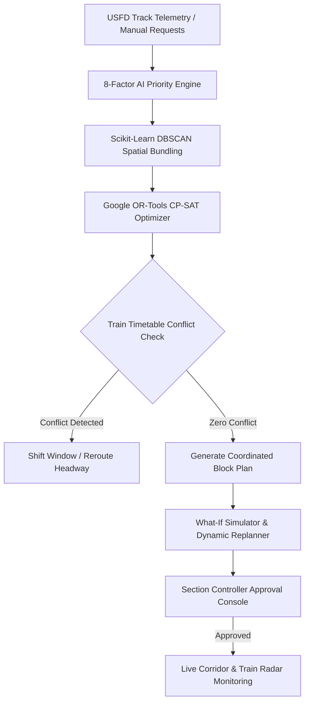

# 🚆 RAILBLOCK AI — Smart Railway Maintenance & Traffic Optimization System

[](https://github.com/santhoshkumarclg514-byte/train-maintenance)
[](https://fastapi.tiangolo.com/)
[](https://nextjs.org/)
[](https://developers.google.com/optimization)
[](https://scikit-learn.org/)

**RAILBLOCK AI** is an intelligent decision-support system (DSS) designed for **Indian Railways** operations. It automates railway track maintenance block scheduling, crew allocation, train conflict detection, dynamic what-if scenario replanning, and human-in-the-loop controller authorizations.

---

## 🌟 Key System Features

1. **🧠 Explainable 8-Factor AI Priority Scoring Engine**: Evaluates track geometry defects, safety risk, section tonnage, asset condition, and overdue status to calculate an objective priority score ($1.0 \rightarrow 10.0$).
2. **📦 DBSCAN Spatial-Temporal Task Bundling**: Automatically groups adjacent track, signalling, and electrical maintenance requests ($\Delta\text{KM} \le 1.5\text{ km}$) to execute concurrent maintenance under a single track possession window (reducing total closures by up to 67%).
3. **⚡ Google OR-Tools CP-SAT Block Optimizer**: Formulates mathematical constraint programming models to schedule maintenance windows without causing headway violations or delaying high-priority passenger trains.
4. **🚆 Live Corridor Train Position Radar**: Real-time linear position tracker with 3-second live telemetry updates, automatic GPS snapping along track corridors, and proximity warning alerts.
5. **🔄 Interactive What-If Scenario Simulator**: Simulates train delays, maintenance duration extensions, and emergency defect injection with instant CP-SAT automated replanning.
6. **🛡️ Human-In-The-Loop Controller Console**: Enables Section Chief Controllers to review AI recommendations, append authorization notes, approve, or reject proposed blocks with instant backend state updates.
7. **🌐 Multi-Language Support**: Built-in support for **English**, **Hindi (हिन्दी)**, and **Tamil (தமிழ்)**.

---

## 🏗️ Tech Stack

### **Backend**
* **Framework**: FastAPI (Python 3.11+)
* **Database & ORM**: SQLAlchemy with SQLite (`railblock.db`)
* **Optimization & ML**: Google OR-Tools (CP-SAT Solver), Scikit-Learn (DBSCAN), NumPy
* **Data Validation**: Pydantic v2
* **LLM Integration**: Google Gemini 2.5 Flash API (Optional for generative incident diagnostics)

### **Frontend**
* **Framework**: Next.js 16 (App Router with Turbopack) & React 19
* **Styling**: Modern Tactile Bento Design System with TailwindCSS v4 & Vanilla CSS
* **Icons**: Lucide React
* **Language**: TypeScript

---

## 📐 Architecture Workflow



---

## 📁 Repository Structure

```
train-maintenance/
├── backend/
│   ├── main.py              # Main FastAPI application & REST endpoints
│   ├── database.py          # SQLAlchemy models & database connection
│   ├── priority_engine.py   # 8-factor AI maintenance scoring algorithm
│   ├── bundler.py           # DBSCAN spatial-temporal bundling logic
│   ├── optimizer.py         # Google OR-Tools CP-SAT solver model
│   ├── conflict_detector.py # Train headway intersection & delay calculator
│   ├── simulator.py         # What-If scenario simulation engine
│   ├── team_allocator.py    # Crew & equipment allocation matrix
│   ├── fault_detector.py    # Live telemetry positioning & anomaly engine
│   ├── seed_data.py         # Initial synthetic dataset seeding
│   ├── .env.example         # Backend environment variables example
│   └── railblock.db         # SQLite database storage
├── frontend/
│   ├── src/
│   │   ├── app/
│   │   │   ├── page.tsx          # Main Executive Dashboard
│   │   │   ├── corridor/      # Track Corridor & Live Map View
│   │   │   ├── optimizer/     # AI Block Optimizer & What-If Simulator
│   │   │   ├── requests/      # Maintenance Request Management
│   │   │   ├── inspections/   # USFD Telemetry Stream
│   │   │   ├── approvals/     # Section Controller Console
│   │   │   └── timetable/     # Train Timetable & Headway Matrix
│   │   ├── components/        # Reusable UI components & Live Radar
│   │   ├── context/           # Data & Internationalization Contexts
│   │   └── services/          # Axios API Service Layer
│   ├── package.json
│   └── tsconfig.json
├── .gitignore
└── README.md
```

---

## 🚀 Quick Start Guide

### Prerequisites
* **Python 3.9+** installed (`py` or `python`)
* **Node.js 18+** and `npm` installed

---

### 1. Backend Setup & Run

1. Navigate to the `backend/` directory:
   ```bash
   cd backend
   ```

2. Install Python dependencies:
   ```bash
   py -m pip install fastapi uvicorn sqlalchemy ortools scikit-learn pydantic
   ```

3. (Optional) Configure environment variables:
   ```bash
   cp .env.example .env
   ```

4. Launch the FastAPI backend server:
   ```bash
   py -m uvicorn main:app --host 127.0.0.1 --port 8000 --reload
   ```

* **API Base URL:** `http://127.0.0.1:8000`
* **Interactive OpenAPI Swagger Docs:** `http://127.0.0.1:8000/docs`

---

### 2. Frontend Setup & Run

1. Open a new terminal tab and navigate to the `frontend/` directory:
   ```bash
   cd frontend
   ```

2. Install Node dependencies:
   ```bash
   npm install
   ```

3. Start the Next.js development server:
   ```bash
   npm run dev
   ```

* **Web Application URL:** `http://localhost:3000`

---

## 📡 API Endpoints Summary

| Method | Endpoint | Description |
| :--- | :--- | :--- |
| `GET` | `/api/dashboard` | Aggregated network stats, critical alerts, and active block |
| `GET` | `/api/trains/live` | Live telemetry stream of active en-route trains with GPS coordinates |
| `POST` | `/api/telemetry/push` | Ingest live GPS telemetry fix from smartphone or hardware module |
| `POST` | `/api/priority` | Compute 8-factor explainable priority score for a maintenance defect |
| `GET` | `/api/maintenance` | Fetch all logged maintenance requests |
| `POST` | `/api/maintenance` | Log new maintenance defect request with auto crew allocation |
| `GET` | `/api/inspection` | USFD ultrasonic inspection logs and anomaly diagnostics |
| `POST` | `/api/optimize` | Run DBSCAN task bundler and CP-SAT solver to schedule block |
| `POST` | `/api/what-if` | Execute dynamic what-if simulation (train delay, emergency block) |
| `POST` | `/api/plans/{id}/approve` | Section Controller approval of proposed block plan |
| `POST` | `/api/plans/{id}/reject` | Section Controller rejection of proposed block plan |

---

## 📄 License & Attribution

Developed for **Smart India Hackathon (SIH)** — Railway Track Maintenance & Traffic Decision Support Prototype.

